# Kubernetes & Helm — Theory Deep Dive

> **How to read this document**
> Every topic starts with a **Layman explanation** (no tech background needed),
> then goes into a **Technical deep-dive** with diagrams.
> Read top to bottom, or jump to any section using the Table of Contents.

---

## Table of Contents

1. [The Big Picture — Why Any of This Exists](#1-the-big-picture--why-any-of-this-exists)
2. [Kubernetes Architecture](#2-kubernetes-architecture)
3. [The Kubernetes Objects](#3-the-kubernetes-objects)
   - 3.1 [Pod](#31-pod)
   - 3.2 [ReplicaSet](#32-replicaset)
   - 3.3 [Deployment](#33-deployment)
   - 3.4 [Service](#34-service)
   - 3.5 [Ingress](#35-ingress)
   - 3.6 [ConfigMap & Secret](#36-configmap--secret)
   - 3.7 [Namespace](#37-namespace)
   - 3.8 [HorizontalPodAutoscaler (HPA)](#38-horizontalpodautoscaler-hpa)
4. [How Kubernetes Keeps Things Running](#4-how-kubernetes-keeps-things-running)
5. [Rolling Updates & Rollbacks](#5-rolling-updates--rollbacks)
6. [Networking Inside Kubernetes](#6-networking-inside-kubernetes)
7. [Helm — Theory](#7-helm--theory)
   - 7.1 [What Problem Helm Solves](#71-what-problem-helm-solves)
   - 7.2 [Helm Architecture](#72-helm-architecture)
   - 7.3 [The Template Engine](#73-the-template-engine)
   - 7.4 [Release Lifecycle](#74-release-lifecycle)
8. [Kubernetes + Helm + Jenkins — The Full Pipeline](#8-kubernetes--helm--jenkins--the-full-pipeline)
9. [Mental Models — Analogies Summary](#9-mental-models--analogies-summary)

---

## 1. The Big Picture — Why Any of This Exists

### Layman

Imagine you run a bakery website. At 8 AM when people order breakfast, 10,000 people hit your site at once. At midnight, only 3 people visit. With a normal server, you either:

- **Over-provision** — pay for 10,000-user capacity 24/7 even at midnight (expensive)
- **Under-provision** — save money but the site crashes at 8 AM (bad)

Also, what happens if the server catches fire? The site goes down until someone manually reboots it.

Kubernetes solves both problems:
- It **automatically scales** your app up when busy, down when quiet
- It **automatically restarts** crashed containers without anyone waking up at 3 AM

### Technical

Before Kubernetes, running containers in production meant either:

- Running `docker run` manually per server (doesn't scale)
- Writing custom shell scripts to restart crashed containers (fragile)
- Using a cloud VM per service (expensive, slow to scale)

Kubernetes is a **container orchestration platform**. It provides:

| Capability | What it means |
|-----------|--------------|
| **Scheduling** | Decides which Node (machine) a container runs on based on available CPU/memory |
| **Self-healing** | Detects crashed containers and replaces them automatically |
| **Horizontal scaling** | Adds/removes container replicas based on load |
| **Rolling updates** | Deploys new versions with zero downtime |
| **Service discovery** | Containers find each other by name, not IP |
| **Load balancing** | Distributes traffic across all healthy replicas |
| **Configuration management** | Injects config/secrets without rebuilding images |

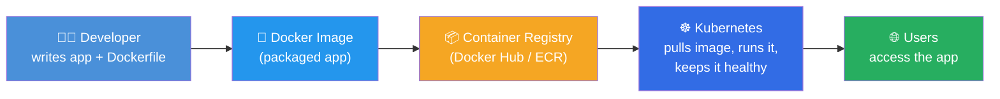
```mermaid
graph LR
    A["👨‍💻 Developer<br/>writes app + Dockerfile"] --> B["🐳 Docker Image<br/>(packaged app)"]
    B --> C["📦 Container Registry<br/>(Docker Hub / ECR)"]
    C --> D["☸️ Kubernetes<br/>pulls image, runs it,<br/>keeps it healthy"]
    D --> E["🌐 Users<br/>access the app"]

    style A fill:#4A90D9,color:#fff
    style B fill:#2496ED,color:#fff
    style C fill:#F5A623,color:#fff
    style D fill:#326CE5,color:#fff
    style E fill:#27AE60,color:#fff
```

---

## 2. Kubernetes Architecture

### Layman

Think of Kubernetes like a **restaurant**:

- The **Manager (Control Plane)** takes orders, decides which chef handles what, monitors the kitchen
- The **Chefs (Worker Nodes)** actually cook the food (run the containers)
- The **Dishes (Pods)** are what get delivered to customers (handle user traffic)

The Manager never cooks. The Chefs never take orders. Clear separation.

### Technical

A Kubernetes cluster has two types of machines:

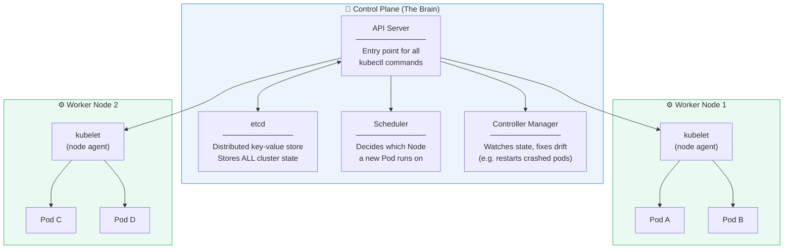
```mermaid
graph TB
    subgraph CP["🧠 Control Plane (The Brain)"]
        API["API Server<br/>─────────────<br/>Entry point for all<br/>kubectl commands"]
        ETCD["etcd<br/>─────────────<br/>Distributed key-value store<br/>Stores ALL cluster state"]
        SCHED["Scheduler<br/>─────────────<br/>Decides which Node<br/>a new Pod runs on"]
        CM["Controller Manager<br/>─────────────<br/>Watches state, fixes drift<br/>(e.g. restarts crashed pods)"]
    end

    subgraph W1["⚙️ Worker Node 1"]
        KP1["kubelet<br/>(node agent)"]
        KP1 --> POD1["Pod A"]
        KP1 --> POD2["Pod B"]
    end

    subgraph W2["⚙️ Worker Node 2"]
        KP2["kubelet<br/>(node agent)"]
        KP2 --> POD3["Pod C"]
        KP2 --> POD4["Pod D"]
    end

    API <--> ETCD
    API --> SCHED
    API --> CM
    API --> KP1
    API --> KP2

    style CP fill:#EBF5FB,stroke:#2E86C1
    style W1 fill:#EAFAF1,stroke:#27AE60
    style W2 fill:#EAFAF1,stroke:#27AE60
```

#### Control Plane Components

| Component | Role | Analogy |
|-----------|------|---------|
| **API Server** | The only entry point. Every `kubectl` command hits this. | Restaurant reception desk |
| **etcd** | Distributed database that stores every piece of cluster state. If etcd dies, the cluster cannot make decisions. | The restaurant's order book |
| **Scheduler** | When a new Pod needs to run, the Scheduler picks which Node has enough free CPU/memory. | Manager assigning a chef |
| **Controller Manager** | Runs control loops that continuously compare "desired state" vs "actual state" and act to fix any difference. | Floor manager checking tables |

#### Worker Node Components

| Component | Role |
|-----------|------|
| **kubelet** | Agent on every node. Talks to API Server. Makes sure the containers it's told to run are actually running. |
| **kube-proxy** | Handles networking rules on the node so Services route traffic correctly. |
| **Container Runtime** | Actually runs containers (containerd, Docker). kubelet tells it what to do. |

#### The Reconciliation Loop (Most Important Concept)

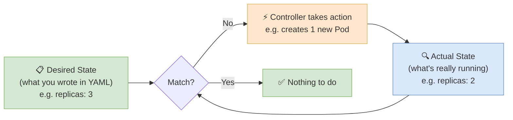
```mermaid
flowchart LR
    DS["📋 Desired State<br/>(what you wrote in YAML)<br/>e.g. replicas: 3"] 
    AS["🔍 Actual State<br/>(what's really running)<br/>e.g. replicas: 2"]
    CC{"Match?"}
    ACT["⚡ Controller takes action<br/>e.g. creates 1 new Pod"]
    
    DS --> CC
    AS --> CC
    CC -- "No" --> ACT
    ACT --> AS
    CC -- "Yes" --> HAPPY["✅ Nothing to do"]

    style DS fill:#D5E8D4,stroke:#82B366
    style AS fill:#DAE8FC,stroke:#6C8EBF
    style ACT fill:#FFE6CC,stroke:#D6B656
    style HAPPY fill:#D5E8D4,stroke:#82B366
```

**This loop runs constantly.** It is why Kubernetes is "self-healing." You never imperatively say "create a pod." You declaratively say "I want 3 pods running." Kubernetes makes reality match your declaration — forever.

---

## 3. The Kubernetes Objects

### 3.1 Pod

#### Layman
A Pod is a wrapper around one or more containers. Think of it as a single **execution unit** — like one worker in a factory. It has its own private phone line (IP address) and locker (storage). If it dies, a new worker replaces it.

#### Technical

A Pod is the **smallest deployable unit** in Kubernetes. Key facts:

- Every Pod gets a unique IP address inside the cluster
- Containers inside the same Pod share that IP (they communicate via `localhost`)
- Pods are **ephemeral** — they are designed to be thrown away and replaced
- You almost never create a Pod directly — you create a Deployment that manages Pods for you

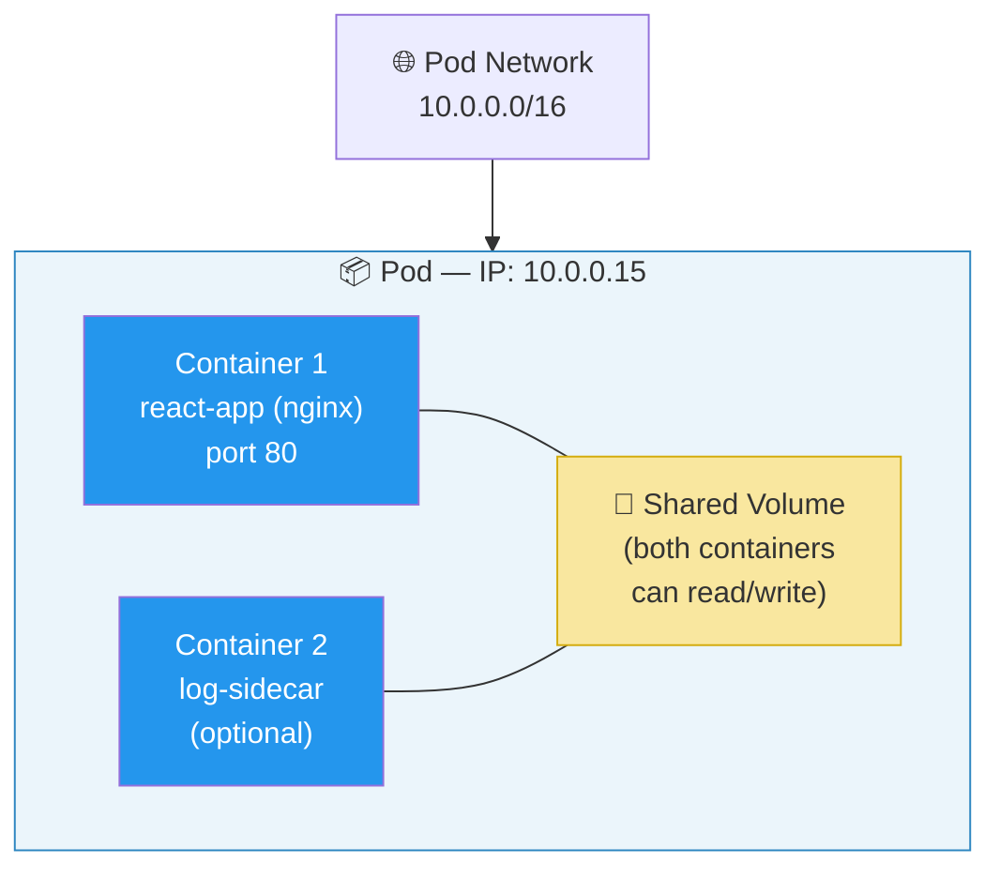
```mermaid
graph TB
    subgraph POD["📦 Pod — IP: 10.0.0.15"]
        direction LR
        C1["Container 1<br/>react-app (nginx)<br/>port 80"]
        C2["Container 2<br/>log-sidecar<br/>(optional)"]
        VOL["📁 Shared Volume<br/>(both containers<br/>can read/write)"]
        C1 --- VOL
        C2 --- VOL
    end

    NET["🌐 Pod Network<br/>10.0.0.0/16"]
    NET --> POD

    style POD fill:#EBF5FB,stroke:#2E86C1
    style C1 fill:#2496ED,color:#fff
    style C2 fill:#2496ED,color:#fff
    style VOL fill:#F9E79F,stroke:#D4AC0D
```

**Sidecar pattern:** Running a helper container (logs, metrics, proxy) alongside the main container in the same Pod. They share the same network and filesystem.

**Pod lifecycle:**

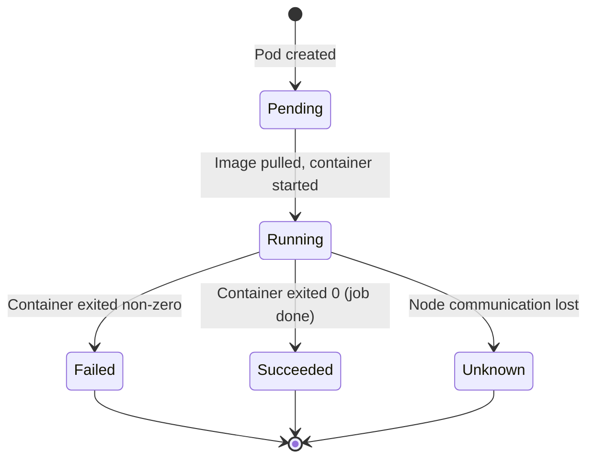
```mermaid
stateDiagram-v2
    [*] --> Pending : Pod created
    Pending --> Running : Image pulled, container started
    Running --> Succeeded : Container exited 0 (job done)
    Running --> Failed : Container exited non-zero
    Running --> Unknown : Node communication lost
    Failed --> [*]
    Succeeded --> [*]
    Unknown --> [*]
```

---

### 3.2 ReplicaSet

#### Layman
A ReplicaSet is like a **staffing agency contract** that says: "I need exactly 3 workers with the skill `app=react-app` on the floor at all times." If one quits (crashes), the agency automatically sends a replacement.

#### Technical

A ReplicaSet's job is simple: **ensure N copies of a Pod template are running at all times.**

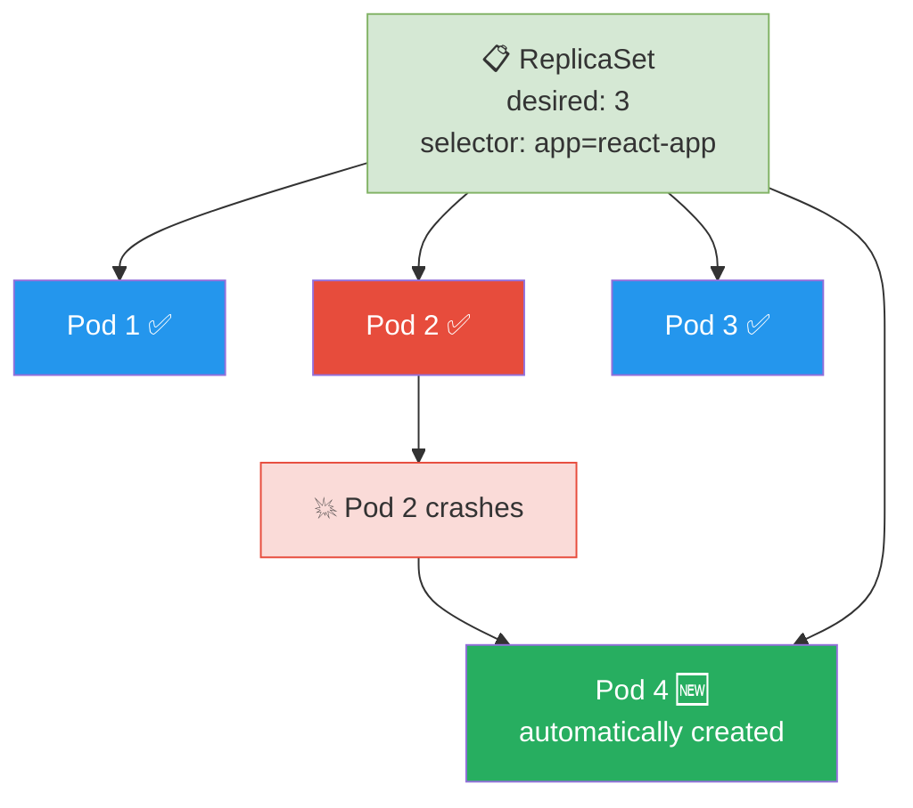
```mermaid
graph TB
    RS["📋 ReplicaSet<br/>desired: 3<br/>selector: app=react-app"]
    
    RS --> P1["Pod 1 ✅"]
    RS --> P2["Pod 2 ✅"]
    RS --> P3["Pod 3 ✅"]

    CRASH["💥 Pod 2 crashes"]
    P2 --> CRASH
    
    CRASH --> NEW["Pod 4 🆕<br/>automatically created"]
    RS --> NEW

    style RS fill:#D5E8D4,stroke:#82B366
    style P1 fill:#2496ED,color:#fff
    style P2 fill:#E74C3C,color:#fff
    style P3 fill:#2496ED,color:#fff
    style NEW fill:#27AE60,color:#fff
    style CRASH fill:#FADBD8,stroke:#E74C3C
```

> You rarely interact with ReplicaSets directly. Deployments create and manage them for you.

---

### 3.3 Deployment

#### Layman
A Deployment is like a **project manager** for your app. It manages the ReplicaSet (the staffing contract), and when you want to release a new version of your app, it handles the changeover smoothly — new workers come in, old workers leave gradually, no disruption to customers.

#### Technical

A Deployment wraps a ReplicaSet and adds:
- **Declarative updates** — you describe the desired end state, it figures out how to get there
- **Rolling update strategy** — controlled, zero-downtime upgrades
- **Rollback** — instantly revert to any previous version

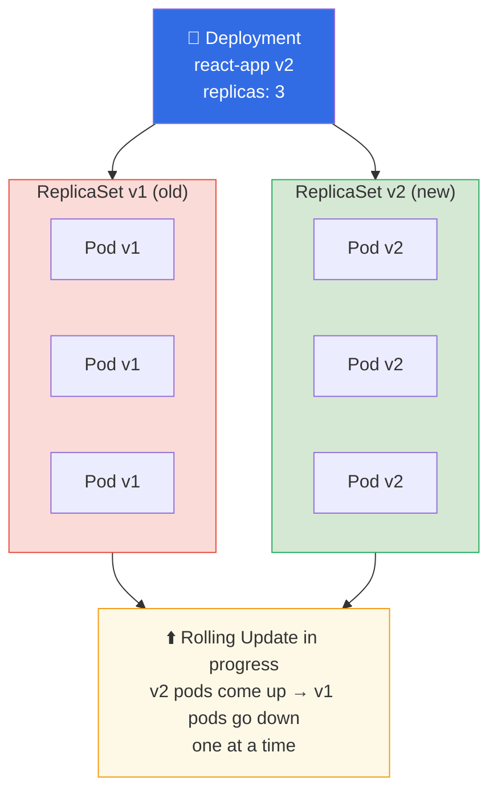
```mermaid
graph TB
    DEP["🚀 Deployment<br/>react-app v2<br/>replicas: 3"]

    subgraph OLD["ReplicaSet v1 (old)"]
        P1O["Pod v1"]
        P2O["Pod v1"]
        P3O["Pod v1"]
    end

    subgraph NEW["ReplicaSet v2 (new)"]
        P1N["Pod v2"]
        P2N["Pod v2"]
        P3N["Pod v2"]
    end

    DEP --> OLD
    DEP --> NEW

    UP["⬆️ Rolling Update in progress<br/>v2 pods come up → v1 pods go down<br/>one at a time"]

    OLD --> UP
    NEW --> UP

    style DEP fill:#326CE5,color:#fff
    style OLD fill:#FADBD8,stroke:#E74C3C
    style NEW fill:#D5E8D4,stroke:#27AE60
    style UP fill:#FEF9E7,stroke:#F39C12
```

**Deployment YAML structure:**

```
Deployment
  └── spec.selector         → "manage Pods with these labels"
  └── spec.template         → the Pod blueprint
  └── spec.replicas         → how many Pods to maintain
  └── spec.strategy         → how to roll out updates
        └── RollingUpdate
              ├── maxSurge        → max extra pods during update
              └── maxUnavailable  → max pods allowed to be down
```

---

### 3.4 Service

#### Layman
Pods are like **temporary employees** — they come and go, and each time they come back they have a different desk (IP address). A Service is a **permanent reception desk** with a fixed phone number. No matter how many times employees change, callers always dial the same number and get through to someone.

#### Technical

A Service provides a stable **virtual IP (ClusterIP)** and **DNS name** that routes traffic to matching Pods via label selectors.

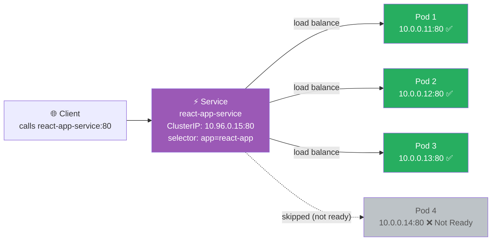
```mermaid
graph LR
    CLIENT["🌐 Client<br/>calls react-app-service:80"] 
    
    SVC["⚡ Service<br/>react-app-service<br/>ClusterIP: 10.96.0.15:80<br/>selector: app=react-app"]

    P1["Pod 1<br/>10.0.0.11:80 ✅"]
    P2["Pod 2<br/>10.0.0.12:80 ✅"]
    P3["Pod 3<br/>10.0.0.13:80 ✅"]
    P4["Pod 4<br/>10.0.0.14:80 ❌ Not Ready"]

    CLIENT --> SVC
    SVC -- "load balance" --> P1
    SVC -- "load balance" --> P2
    SVC -- "load balance" --> P3
    SVC -. "skipped (not ready)" .-> P4

    style SVC fill:#9B59B6,color:#fff
    style P1 fill:#27AE60,color:#fff
    style P2 fill:#27AE60,color:#fff
    style P3 fill:#27AE60,color:#fff
    style P4 fill:#BDC3C7,color:#555
```

**Service types — when to use which:**

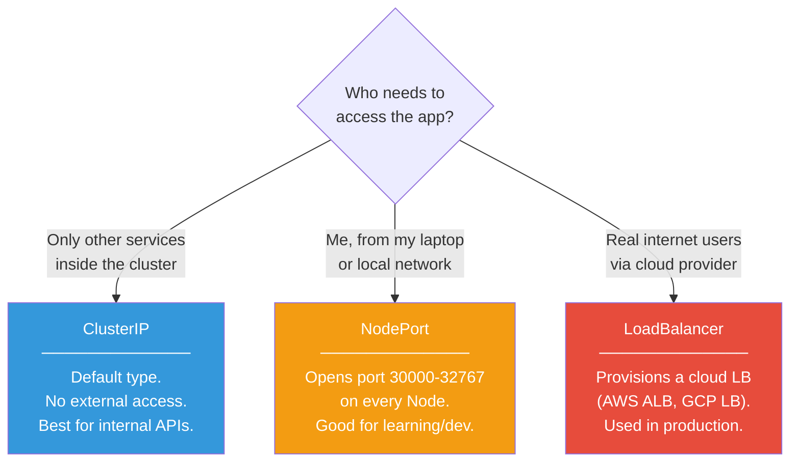
```mermaid
graph TD
    Q1{"Who needs to<br/>access the app?"}
    Q1 -- "Only other services<br/>inside the cluster" --> CT["ClusterIP<br/>─────────────<br/>Default type.<br/>No external access.<br/>Best for internal APIs."]
    Q1 -- "Me, from my laptop<br/>or local network" --> NP["NodePort<br/>─────────────<br/>Opens port 30000-32767<br/>on every Node.<br/>Good for learning/dev."]
    Q1 -- "Real internet users<br/>via cloud provider" --> LB["LoadBalancer<br/>─────────────<br/>Provisions a cloud LB<br/>(AWS ALB, GCP LB).<br/>Used in production."]

    style CT fill:#3498DB,color:#fff
    style NP fill:#F39C12,color:#fff
    style LB fill:#E74C3C,color:#fff
```

---

### 3.5 Ingress

#### Layman
A Service with `LoadBalancer` type gives you one IP per service. If you have 10 services, that's 10 load balancers — expensive. An Ingress is like a **smart receptionist at a hotel**: one entrance, but she routes guests to different floors (services) based on the room number (URL path) or the hotel they booked (hostname).

#### Technical

An Ingress is a routing layer that sits in front of multiple Services. It needs an **Ingress Controller** (e.g. nginx-ingress) to work.

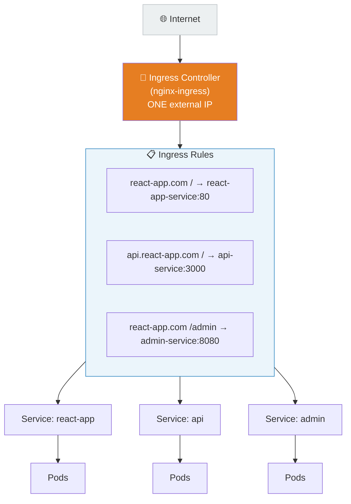
```mermaid
graph TB
    INET["🌐 Internet"]
    
    INET --> IC["🔀 Ingress Controller<br/>(nginx-ingress)<br/>ONE external IP"]

    subgraph INGRESS["📋 Ingress Rules"]
        R1["react-app.com / → react-app-service:80"]
        R2["api.react-app.com / → api-service:3000"]
        R3["react-app.com /admin → admin-service:8080"]
    end

    IC --> INGRESS

    INGRESS --> S1["Service: react-app"]
    INGRESS --> S2["Service: api"]
    INGRESS --> S3["Service: admin"]

    S1 --> PA["Pods"]
    S2 --> PB["Pods"]
    S3 --> PC["Pods"]

    style IC fill:#E67E22,color:#fff
    style INGRESS fill:#EBF5FB,stroke:#2E86C1
    style INET fill:#ECF0F1,stroke:#BDC3C7
```

**Without Ingress vs With Ingress:**

```
WITHOUT INGRESS                    WITH INGRESS
────────────────                   ────────────────
react-app  → LoadBalancer $$$      react-app  ─┐
api        → LoadBalancer $$$      api        ─┤→ 1 Ingress → 1 LoadBalancer $
admin      → LoadBalancer $$$      admin      ─┘
3 LBs, 3 IPs, 3 bills              1 LB, 1 IP, 1 bill
```

---

### 3.6 ConfigMap & Secret

#### Layman
When you bake a cake, the recipe is separate from the oven. You don't rebuild the oven when the recipe changes. ConfigMaps and Secrets are the recipe — configuration that lives outside your container image so you can change it without rebuilding.

**ConfigMap** = public recipe (non-sensitive config like port numbers, feature flags)
**Secret** = locked recipe box (sensitive data: passwords, API keys — stored base64-encoded)

#### Technical

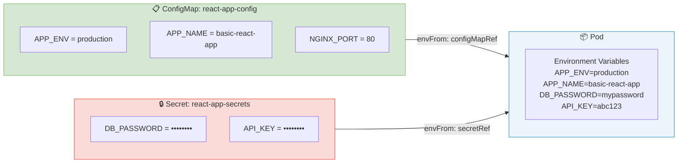
```mermaid
graph LR
    subgraph CM["📋 ConfigMap: react-app-config"]
        KV1["APP_ENV = production"]
        KV2["APP_NAME = basic-react-app"]
        KV3["NGINX_PORT = 80"]
    end

    subgraph SEC["🔒 Secret: react-app-secrets"]
        SK1["DB_PASSWORD = ••••••••"]
        SK2["API_KEY = ••••••••"]
    end

    subgraph POD["📦 Pod"]
        ENV["Environment Variables<br/>APP_ENV=production<br/>APP_NAME=basic-react-app<br/>DB_PASSWORD=mypassword<br/>API_KEY=abc123"]
    end

    CM -- "envFrom: configMapRef" --> POD
    SEC -- "envFrom: secretRef" --> POD

    style CM fill:#D5E8D4,stroke:#82B366
    style SEC fill:#FADBD8,stroke:#E74C3C
    style POD fill:#EBF5FB,stroke:#2E86C1
```

**Two injection methods:**

```
Method 1: Environment Variables          Method 2: Mounted as Files
──────────────────────────────           ────────────────────────────
envFrom:                                 volumes:
  - configMapRef:                          - name: config-vol
      name: react-app-config                 configMap:
                                               name: react-app-config
→ Every key becomes an env var           volumeMounts:
  inside the container.                    - mountPath: /etc/config
                                             name: config-vol
                                         → Each key becomes a FILE
                                           at /etc/config/<key>
```

---

### 3.7 Namespace

#### Layman
A Namespace is like a **floor in an office building**. The building (cluster) is shared, but HR lives on floor 2 and Engineering lives on floor 5. They don't accidentally step on each other's work even though they're in the same building.

#### Technical

Namespaces provide resource isolation, access control (RBAC), and resource quotas within a single cluster.

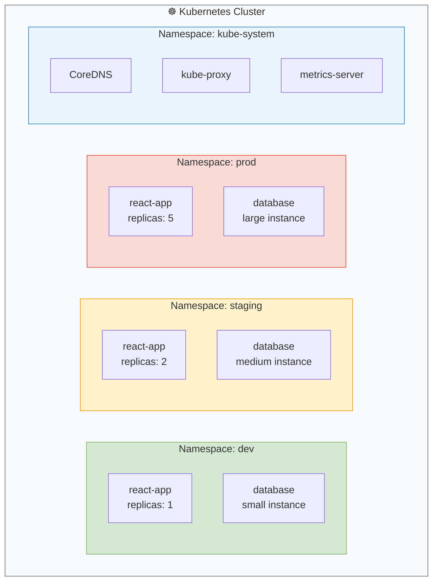
```mermaid
graph TB
    subgraph CLUSTER["☸️ Kubernetes Cluster"]
        subgraph NS_DEV["Namespace: dev"]
            APP_DEV["react-app<br/>replicas: 1"]
            DB_DEV["database<br/>small instance"]
        end

        subgraph NS_STAGING["Namespace: staging"]
            APP_STG["react-app<br/>replicas: 2"]
            DB_STG["database<br/>medium instance"]
        end

        subgraph NS_PROD["Namespace: prod"]
            APP_PRD["react-app<br/>replicas: 5"]
            DB_PRD["database<br/>large instance"]
        end

        subgraph NS_KUBE["Namespace: kube-system"]
            DNS["CoreDNS"]
            PROXY["kube-proxy"]
            METRIC["metrics-server"]
        end
    end

    style NS_DEV fill:#D5E8D4,stroke:#82B366
    style NS_STAGING fill:#FFF3CD,stroke:#F39C12
    style NS_PROD fill:#FADBD8,stroke:#E74C3C
    style NS_KUBE fill:#EBF5FB,stroke:#2E86C1
    style CLUSTER fill:#F8F9FA,stroke:#6C757D
```

**Default namespaces in every cluster:**

| Namespace | Purpose |
|-----------|---------|
| `default` | Where resources go if you don't specify a namespace |
| `kube-system` | Kubernetes internal components (DNS, proxy, scheduler) |
| `kube-public` | Publicly readable data (cluster info) |
| `kube-node-lease` | Node heartbeat records |

---

### 3.8 HorizontalPodAutoscaler (HPA)

#### Layman
The HPA is like a **smart workforce manager** watching a queue at a ticket counter. If the queue gets long (CPU goes up), she calls in more staff (adds pods). When the queue empties (CPU drops), she sends staff home (removes pods). Automatically. No human intervention.

#### Technical

The HPA reads metrics from the **Metrics Server**, compares them to your targets, and adjusts the Deployment's `replicas` field.

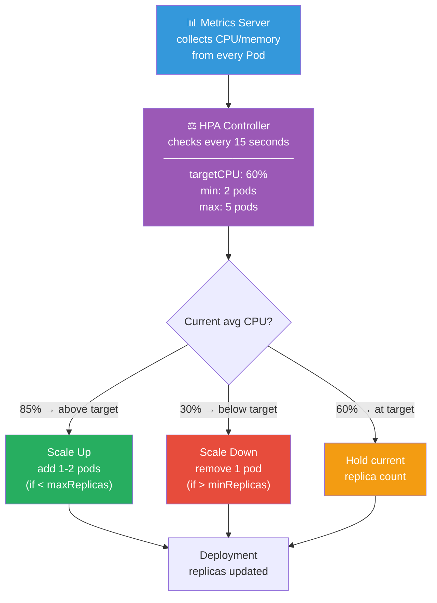
```mermaid
graph TB
    MS["📊 Metrics Server<br/>collects CPU/memory<br/>from every Pod"]
    
    HPA["⚖️ HPA Controller<br/>checks every 15 seconds<br/>─────────────────<br/>targetCPU: 60%<br/>min: 2 pods<br/>max: 5 pods"]

    CALC{"Current avg CPU?"}

    MS --> HPA
    HPA --> CALC

    CALC -- "30% → below target" --> SCALE_DOWN["Scale Down<br/>remove 1 pod<br/>(if > minReplicas)"]
    CALC -- "60% → at target" --> HOLD["Hold current<br/>replica count"]
    CALC -- "85% → above target" --> SCALE_UP["Scale Up<br/>add 1-2 pods<br/>(if < maxReplicas)"]

    SCALE_UP --> DEP["Deployment<br/>replicas updated"]
    SCALE_DOWN --> DEP
    HOLD --> DEP

    style HPA fill:#9B59B6,color:#fff
    style MS fill:#3498DB,color:#fff
    style SCALE_UP fill:#27AE60,color:#fff
    style SCALE_DOWN fill:#E74C3C,color:#fff
    style HOLD fill:#F39C12,color:#fff
```

**HPA scaling formula:**

```
desiredReplicas = ceil( currentReplicas × (currentMetric / desiredMetric) )

Example:
  currentReplicas  = 2
  currentCPU       = 90%
  targetCPU        = 60%

  desiredReplicas  = ceil( 2 × (90 / 60) )
                   = ceil( 2 × 1.5 )
                   = ceil( 3.0 )
                   = 3  ← Kubernetes adds 1 more Pod
```

---

## 4. How Kubernetes Keeps Things Running

### Layman
Kubernetes is like a **very attentive babysitter**. Every few seconds it checks: "Are all the kids (pods) still awake and playing (healthy)?" If one falls asleep (crashes), the babysitter wakes it up (restarts it). If one seems confused (unresponsive), the babysitter stops sending visitors to that kid until they recover.

### Technical — Health Probes

Every container can declare two probes:

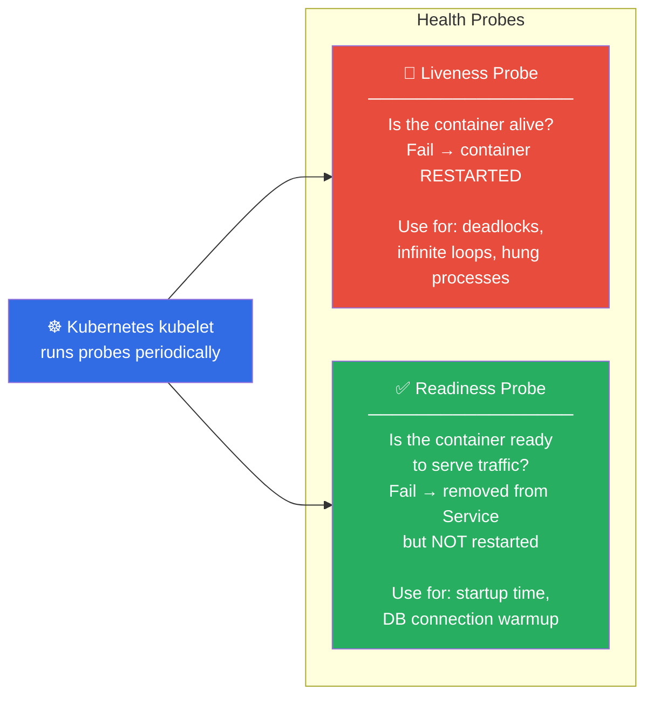
```mermaid
graph LR
    subgraph PROBES["Health Probes"]
        LP["💓 Liveness Probe<br/>─────────────────<br/>Is the container alive?<br/>Fail → container RESTARTED<br/><br/>Use for: deadlocks,<br/>infinite loops, hung processes"]
        
        RP["✅ Readiness Probe<br/>─────────────────<br/>Is the container ready<br/>to serve traffic?<br/>Fail → removed from Service<br/>but NOT restarted<br/><br/>Use for: startup time,<br/>DB connection warmup"]
    end

    K8S["☸️ Kubernetes kubelet<br/>runs probes periodically"]
    K8S --> LP
    K8S --> RP

    style LP fill:#E74C3C,color:#fff
    style RP fill:#27AE60,color:#fff
    style K8S fill:#326CE5,color:#fff
```

**Probe timeline for a newly started Pod:**

```
TIME:  0s          5s            10s           15s          20s
       │           │              │             │             │
       ├───────────┤──────────────┤─────────────┤─────────────┤
       │  starting │ initialDelay │  probe runs │ probe runs  │
       │           │  (5s wait)   │  PASS ✅    │  PASS ✅    │
       │           │              │             │             │
       │           │              │  Pod added  │             │
       │           │              │  to Service │             │
       │                                                      │
       └── Traffic NOT sent here ──────────────┘── Traffic sent here ──▶
```

**Probe methods:**

| Method | How it works | Best for |
|--------|-------------|----------|
| `httpGet` | HTTP GET to a path; 200-399 = healthy | Web servers |
| `tcpSocket` | Opens a TCP connection; success = healthy | Databases, non-HTTP services |
| `exec` | Runs a command inside the container; exit 0 = healthy | Custom checks |

---

## 5. Rolling Updates & Rollbacks

### Layman
Imagine updating the menu at a restaurant while it's open. You don't close the whole restaurant, change everything, then reopen. Instead:
- New menus come to tables 1-5 first
- You wait to make sure customers at those tables are happy
- Then tables 6-10 get the new menu
- Old menus only leave when new ones are confirmed working

That is a **rolling update**. If customers start complaining, you roll back to the old menu instantly.

### Technical

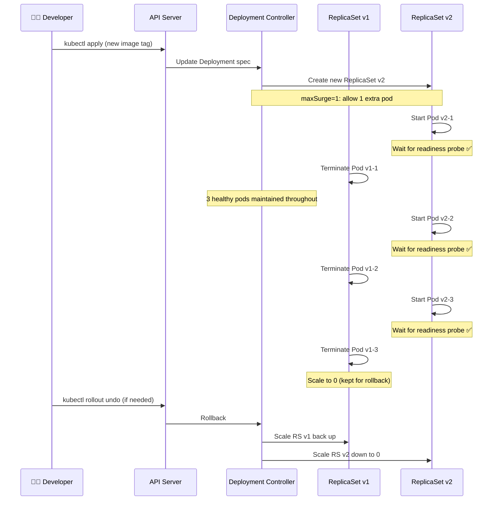
```mermaid
sequenceDiagram
    participant Dev as 👨‍💻 Developer
    participant API as API Server
    participant DEP as Deployment Controller
    participant RS_OLD as ReplicaSet v1
    participant RS_NEW as ReplicaSet v2

    Dev->>API: kubectl apply (new image tag)
    API->>DEP: Update Deployment spec
    DEP->>RS_NEW: Create new ReplicaSet v2
    
    Note over DEP,RS_NEW: maxSurge=1: allow 1 extra pod

    RS_NEW->>RS_NEW: Start Pod v2-1
    Note over RS_NEW: Wait for readiness probe ✅
    
    RS_OLD->>RS_OLD: Terminate Pod v1-1
    Note over DEP: 3 healthy pods maintained throughout

    RS_NEW->>RS_NEW: Start Pod v2-2
    Note over RS_NEW: Wait for readiness probe ✅
    
    RS_OLD->>RS_OLD: Terminate Pod v1-2

    RS_NEW->>RS_NEW: Start Pod v2-3
    Note over RS_NEW: Wait for readiness probe ✅
    
    RS_OLD->>RS_OLD: Terminate Pod v1-3
    
    Note over RS_OLD: Scale to 0 (kept for rollback)
    Dev->>API: kubectl rollout undo (if needed)
    API->>DEP: Rollback
    DEP->>RS_OLD: Scale RS v1 back up
    DEP->>RS_NEW: Scale RS v2 down to 0
```

**The two strategies:**

```
RollingUpdate (default)            Recreate
────────────────────────           ──────────
v1 ████████                        v1 ████████
   ██████▓▓                           ████████  ← all v1 pods deleted
   █████▓▓▓                                     ← gap in service ⚠️
   ████▓▓▓▓                        v2 ████████
   zero downtime ✅                faster but causes downtime ⚠️
```

---

## 6. Networking Inside Kubernetes

### Layman
Inside a Kubernetes cluster, every Pod has its own private address — like every apartment having a phone extension. The Service is the switchboard — you dial "react-app" and the switchboard figures out which apartment is home and connects you. The Ingress is the main building entrance — it decides which apartment block to send you to based on the address you gave.

### Technical

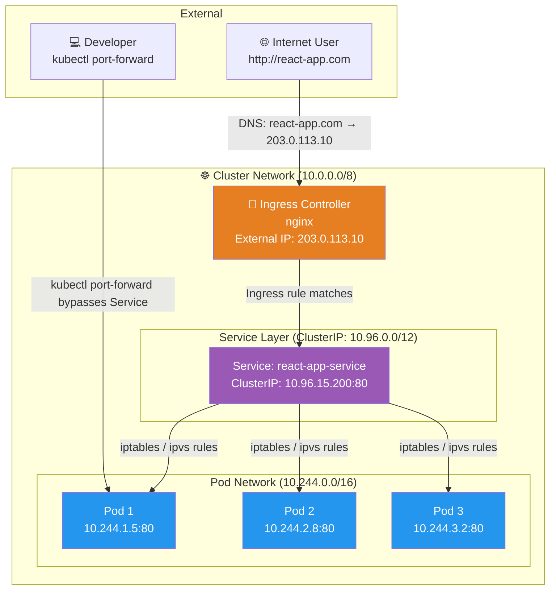
```mermaid
graph TB
    subgraph EXT["External"]
        USER["🌐 Internet User<br/>http://react-app.com"]
        DEV["💻 Developer<br/>kubectl port-forward"]
    end

    subgraph CLUSTER["☸️ Cluster Network (10.0.0.0/8)"]
        IC["🔀 Ingress Controller<br/>nginx<br/>External IP: 203.0.113.10"]

        subgraph SVC_LAYER["Service Layer (ClusterIP: 10.96.0.0/12)"]
            SVC["Service: react-app-service<br/>ClusterIP: 10.96.15.200:80"]
        end

        subgraph POD_LAYER["Pod Network (10.244.0.0/16)"]
            POD1["Pod 1<br/>10.244.1.5:80"]
            POD2["Pod 2<br/>10.244.2.8:80"]
            POD3["Pod 3<br/>10.244.3.2:80"]
        end
    end

    USER -- "DNS: react-app.com → 203.0.113.10" --> IC
    IC -- "Ingress rule matches" --> SVC
    SVC -- "iptables / ipvs rules" --> POD1
    SVC -- "iptables / ipvs rules" --> POD2
    SVC -- "iptables / ipvs rules" --> POD3
    DEV -- "kubectl port-forward bypasses Service" --> POD1

    style IC fill:#E67E22,color:#fff
    style SVC fill:#9B59B6,color:#fff
    style POD1 fill:#2496ED,color:#fff
    style POD2 fill:#2496ED,color:#fff
    style POD3 fill:#2496ED,color:#fff
```

**DNS inside the cluster:**

Every Service automatically gets a DNS entry in the format:
```
<service-name>.<namespace>.svc.cluster.local

Examples:
  react-app-service.react-app.svc.cluster.local
  react-app-service.react-app          ← short form (same namespace)
  react-app-service                    ← shortest (same namespace)
```

Pods can call each other by Service name — no hardcoded IPs needed anywhere.

---

## 7. Helm — Theory

### 7.1 What Problem Helm Solves

#### Layman
Imagine you are a builder and you build the same style house for 5 different clients. Without Helm, you draw 5 completely separate blueprints — one per client. With Helm, you have **one master blueprint with gaps** (number of floors, paint colour, garage size), and you fill in the gaps differently for each client. Same blueprint, different configurations. Huge time-saver.

#### Technical

Without Helm, deploying the same app to 3 environments looks like:

```
dev/
├── deployment.yaml    (replicas: 1, image: react-app:dev)
├── service.yaml       (NodePort)
└── configmap.yaml     (APP_ENV: development)

staging/
├── deployment.yaml    (replicas: 2, image: react-app:v1.5)
├── service.yaml       (ClusterIP)
└── configmap.yaml     (APP_ENV: staging)

prod/
├── deployment.yaml    (replicas: 5, image: react-app:v1.5)
├── service.yaml       (LoadBalancer)
└── configmap.yaml     (APP_ENV: production)
```

**9 files, mostly duplicated.** A bug fix to the Deployment YAML means editing 3 files.

With Helm:

```
helm/react-app/
├── templates/
│   ├── deployment.yaml    ← ONE template with {{ .Values.replicaCount }}
│   ├── service.yaml       ← ONE template with {{ .Values.service.type }}
│   └── configmap.yaml     ← ONE template with {{ .Values.config.APP_ENV }}
└── values.yaml            ← defaults

Deploy to dev:     helm install myapp ./react-app --set replicaCount=1
Deploy to staging: helm install myapp ./react-app --set replicaCount=2
Deploy to prod:    helm install myapp ./react-app --set replicaCount=5
```

**3 template files, unlimited environments.** A bug fix means editing 1 file.

---

### 7.2 Helm Architecture

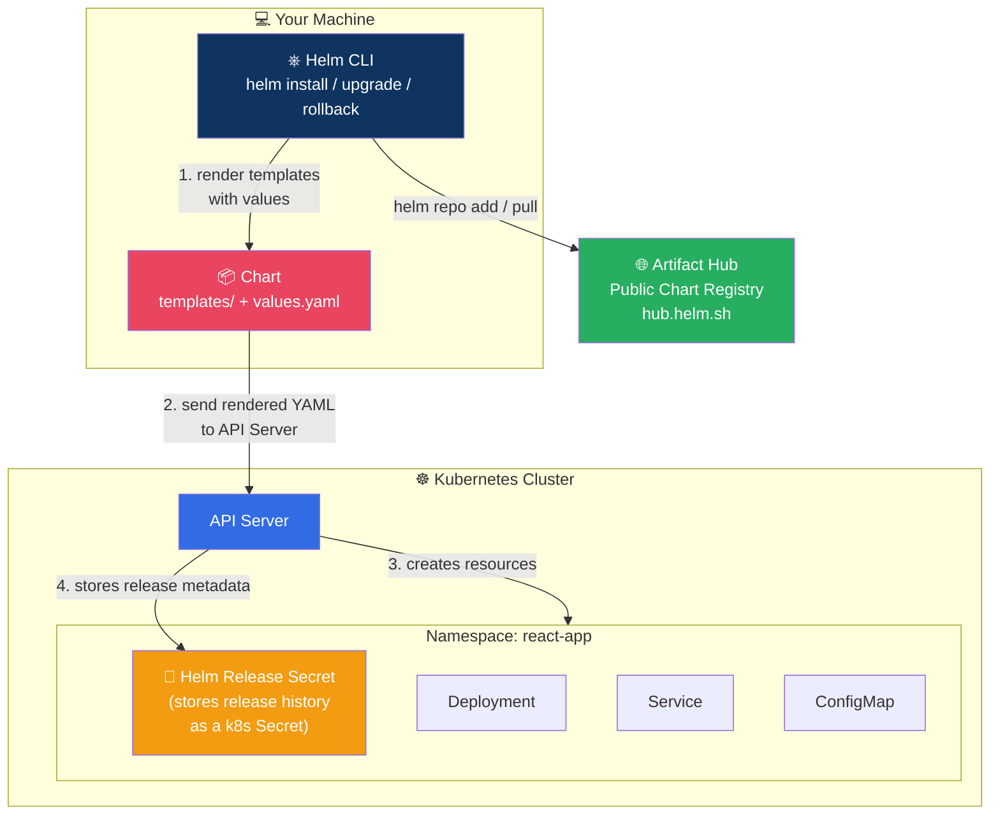
```mermaid
graph TB
    subgraph CLIENT["💻 Your Machine"]
        HELMCLI["⎈ Helm CLI<br/>helm install / upgrade / rollback"]
        CHART["📦 Chart<br/>templates/ + values.yaml"]
    end

    subgraph CLUSTER["☸️ Kubernetes Cluster"]
        API["API Server"]
        
        subgraph NS["Namespace: react-app"]
            SECRET["🔐 Helm Release Secret<br/>(stores release history<br/>as a k8s Secret)"]
            DEP["Deployment"]
            SVC["Service"]
            CM["ConfigMap"]
        end
    end

    REG["🌐 Artifact Hub<br/>Public Chart Registry<br/>hub.helm.sh"]

    HELMCLI -- "1. render templates<br/>with values" --> CHART
    CHART -- "2. send rendered YAML<br/>to API Server" --> API
    API -- "3. creates resources" --> NS
    API -- "4. stores release metadata" --> SECRET
    HELMCLI -- "helm repo add / pull" --> REG

    style HELMCLI fill:#0F3460,color:#fff
    style CHART fill:#E94560,color:#fff
    style API fill:#326CE5,color:#fff
    style SECRET fill:#F39C12,color:#fff
    style REG fill:#27AE60,color:#fff
```

**Key architectural point:** In Helm 3, there is no server-side component. Helm is just a CLI that renders templates and talks to the Kubernetes API directly. Helm stores release state as Kubernetes Secrets inside the cluster itself.

---

### 7.3 The Template Engine

#### Layman
A Helm template is a Kubernetes YAML file with **fill-in-the-blank spots**. The blanks are filled from `values.yaml` when you run `helm install`. It's like a form letter — the letter is the same, the name and address change.

#### Technical

Helm uses the **Go template language**. Here is how it works:

```
values.yaml                   templates/deployment.yaml
───────────                   ─────────────────────────
replicaCount: 3               spec:
image:                          replicas: {{ .Values.replicaCount }}
  repository: react-app         ...
  tag: "latest"                 image: "{{ .Values.image.repository }}:{{ .Values.image.tag }}"


                    ⬇  helm template (render)  ⬇


                   spec:
                     replicas: 3
                     ...
                     image: "react-app:latest"
```

**Common template directives:**

```
{{ .Values.key }}              → insert a value
{{ .Release.Name }}            → Helm release name
{{ .Chart.Version }}           → chart version
{{ include "helper" . }}       → call a named template from _helpers.tpl

{{- if .Values.ingress.enabled }}   → conditional block
  ... only rendered if true
{{- end }}

{{- range $key, $val := .Values.config }}   → loop over a map
  {{ $key }}: {{ $val | quote }}
{{- end }}

{{ .Values.name | upper }}     → pipe through a function (uppercase)
{{ .Values.name | trunc 63 }}  → pipe through trunc (truncate to 63 chars)
```

**Template pipeline (like Unix pipes):**

```
{{ .Values.appName | upper | trunc 10 | trimSuffix "-" }}
     ↓                 ↓          ↓             ↓
  "react-app"   "REACT-APP"  "REACT-APP"   "REACT-APP"
                                (no change)  (no trailing -)
```

---

### 7.4 Release Lifecycle

#### Layman
Think of a Helm release like a **software project**. Every time you ship a new version (`helm upgrade`), a new release entry is created — like a commit. Helm keeps the full history. If v5 has a bug, you say `helm rollback myapp 3` and you are instantly back to how things looked at version 3. No manual undoing required.

#### Technical

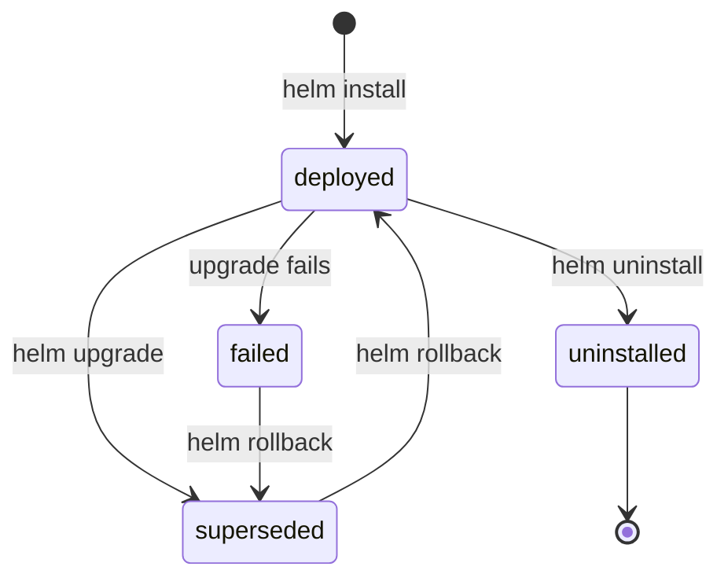
```mermaid
stateDiagram-v2
    [*] --> deployed : helm install
    deployed --> superseded : helm upgrade
    superseded --> deployed : helm rollback
    deployed --> uninstalled : helm uninstall
    deployed --> failed : upgrade fails
    failed --> superseded : helm rollback
    uninstalled --> [*]
```

**Release history stored as Kubernetes Secrets:**

```bash
kubectl get secrets -n react-app
# NAME                              TYPE
# sh.helm.release.v1.myapp.v1       helm.sh/release.v1  ← revision 1
# sh.helm.release.v1.myapp.v2       helm.sh/release.v1  ← revision 2
# sh.helm.release.v1.myapp.v3       helm.sh/release.v1  ← revision 3 (current)
```

Each Secret contains the full rendered manifests of that revision, compressed and base64-encoded. This is how `helm rollback` works — it replays the old manifests.

**Helm release state machine:**

```
helm install    →  REVISION 1  (status: deployed)
helm upgrade    →  REVISION 2  (status: deployed)   REVISION 1 → superseded
helm upgrade    →  REVISION 3  (status: deployed)   REVISION 2 → superseded
helm rollback 1 →  REVISION 4  (status: deployed)   REVISION 3 → superseded
                   (identical to revision 1 manifests, but NEW revision number)
```

---

## 8. Kubernetes + Helm + Jenkins — The Full Pipeline

### Layman
This is the full factory line: a developer writes code → a robot (Jenkins) automatically tests and builds it → packages it into a Docker image → ships it to Kubernetes → Helm installs/updates the app → users see the new version — without anyone manually doing steps 2-6.

### Technical

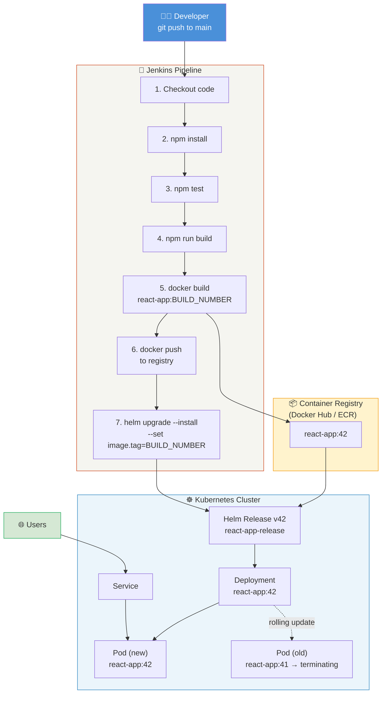
```mermaid
flowchart TD
    DEV["👨‍💻 Developer<br/>git push to main"] 
    
    subgraph JENKINS["🔧 Jenkins Pipeline"]
        J1["1. Checkout code"]
        J2["2. npm install"]
        J3["3. npm test"]
        J4["4. npm run build"]
        J5["5. docker build<br/>react-app:BUILD_NUMBER"]
        J6["6. docker push<br/>to registry"]
        J7["7. helm upgrade --install<br/>--set image.tag=BUILD_NUMBER"]
    end

    subgraph REGISTRY["📦 Container Registry<br/>(Docker Hub / ECR)"]
        IMG["react-app:42"]
    end

    subgraph K8S["☸️ Kubernetes Cluster"]
        HELM_REL["Helm Release v42<br/>react-app-release"]
        DEP2["Deployment<br/>react-app:42"]
        POD_NEW["Pod (new)<br/>react-app:42"]
        POD_OLD["Pod (old)<br/>react-app:41 → terminating"]
        SVC2["Service"]
    end

    USER["🌐 Users"]

    DEV --> J1
    J1 --> J2 --> J3 --> J4 --> J5 --> J6 --> J7
    J5 --> IMG
    IMG --> HELM_REL
    J7 --> HELM_REL
    HELM_REL --> DEP2
    DEP2 --> POD_NEW
    DEP2 -. "rolling update" .-> POD_OLD
    SVC2 --> POD_NEW
    USER --> SVC2

    style DEV fill:#4A90D9,color:#fff
    style JENKINS fill:#F5F5F0,stroke:#D04B20
    style REGISTRY fill:#FFF3CD,stroke:#F39C12
    style K8S fill:#EBF5FB,stroke:#2E86C1
    style USER fill:#D5E8D4,stroke:#27AE60
```

**The flow step by step:**

```
1. DEV: git push
         │
2. JENKINS: triggered by webhook
         │
3. BUILD: npm install → test → npm run build → docker build
         │
4. TAG:  react-app:${BUILD_NUMBER}  (e.g. react-app:42)
         │
5. PUSH: docker push to registry
         │
6. HELM: helm upgrade --install react-app-release ./helm/react-app
              --set image.tag=42
         │
7. K8S:  Deployment updated → Rolling update starts
              New pods (image:42) come up ✅
              Old pods (image:41) are removed
         │
8. USER: zero downtime, sees new version
```

---

## 9. Mental Models — Analogies Summary

Use these analogies when a concept is fuzzy.

| Kubernetes Concept | Analogy | One-line Technical Truth |
|-------------------|---------|--------------------------|
| **Cluster** | A city | A set of machines managed as one unit |
| **Node** | A building in the city | A single machine that runs Pods |
| **Namespace** | A floor in a building | A logical partition of cluster resources |
| **Pod** | An apartment | The smallest runnable unit (wraps containers) |
| **Container** | A person in the apartment | The actual process running your code |
| **Deployment** | Apartment management company | Ensures N pods always run; handles updates |
| **ReplicaSet** | A staffing contract | Maintains exactly N copies of a Pod |
| **Service** | The building's permanent phone number | Stable network endpoint routing to healthy Pods |
| **Ingress** | Hotel reception routing guests | HTTP router mapping domains/paths to Services |
| **ConfigMap** | A noticeboard with public info | Non-sensitive key-value config injected into Pods |
| **Secret** | A locked safe | Sensitive data stored base64-encoded |
| **HPA** | A smart shift manager | Auto-scales pod count based on CPU/memory |
| **Helm Chart** | A blueprint template | Parameterised package of Kubernetes YAML |
| **Helm Release** | A completed construction project | A deployed instance of a chart with history |
| **values.yaml** | Order form for the blueprint | Inputs that fill in the chart's placeholders |
| **Helm Rollback** | Reverting to a previous blueprint | Replays an earlier release's rendered manifests |

---

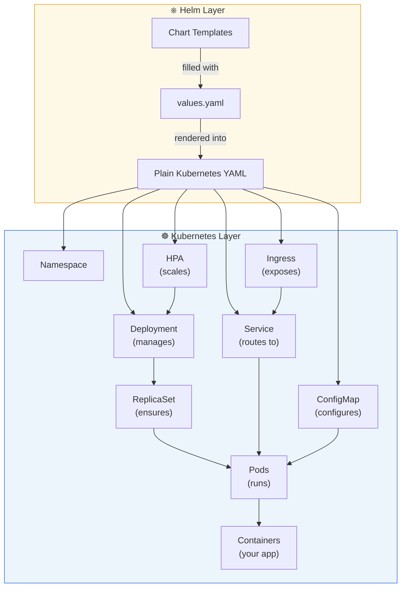
```mermaid
graph TB
    subgraph HELM["⎈ Helm Layer"]
        CHART2["Chart Templates"] -- "filled with" --> VALUES["values.yaml"]
        VALUES -- "rendered into" --> MANIFESTS["Plain Kubernetes YAML"]
    end

    subgraph K8S2["☸️ Kubernetes Layer"]
        MANIFESTS --> NS2["Namespace"]
        MANIFESTS --> DEP3["Deployment<br/>(manages)"]
        DEP3 --> RS["ReplicaSet<br/>(ensures)"]
        RS --> PODS["Pods<br/>(runs)"]
        PODS --> CONTAINERS["Containers<br/>(your app)"]
        MANIFESTS --> SVC3["Service<br/>(routes to)"]
        SVC3 --> PODS
        MANIFESTS --> ING["Ingress<br/>(exposes)"]
        ING --> SVC3
        MANIFESTS --> CM2["ConfigMap<br/>(configures)"]
        CM2 --> PODS
        MANIFESTS --> HPA2["HPA<br/>(scales)"]
        HPA2 --> DEP3
    end

    style HELM fill:#FEF9E7,stroke:#F39C12
    style K8S2 fill:#EBF5FB,stroke:#326CE5
```

> **Read next:** [KUBERNETES_HELM_GUIDE.md](KUBERNETES_HELM_GUIDE.md) for hands-on labs that apply everything in this document.
